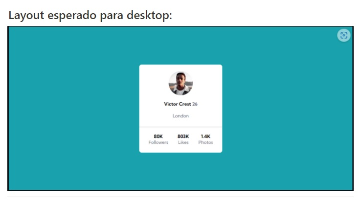
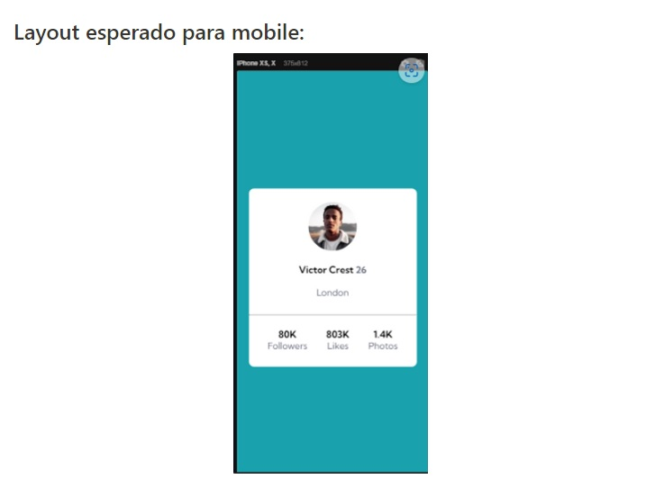
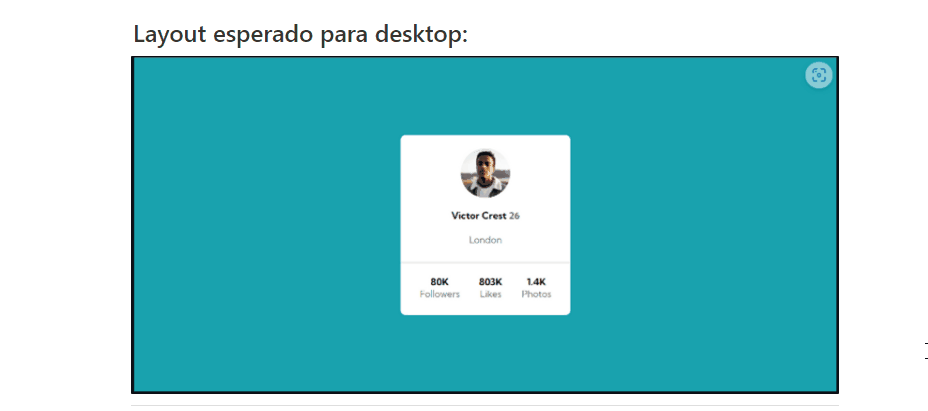
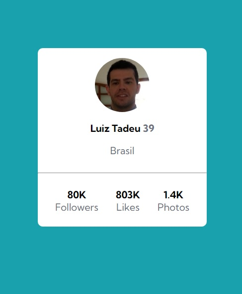

# README - Exercício Avançado CSS - FLEX - 01
Estudo de caso FLEX. Desenvolvimento de Profile Card. Usamos no projeto linguagem HTML e CSS. Nesse projeto não usamos a responsividade haja vista referido cartão ser totalmente flexível. 🚀🚀 

Abaixo estão as imagens e gif´s do site que foi reproduzido.

[]

[]

[]

## Tecnologias Utilizadas
- HTML
- CSS
